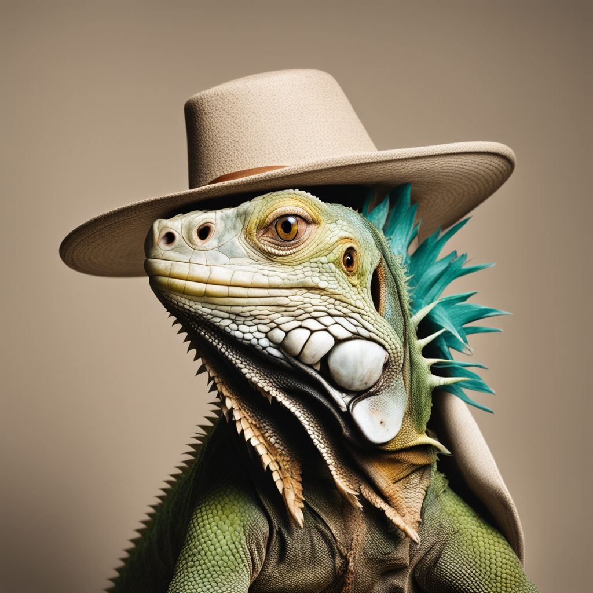

# stability-ai/sdxl Cog model

This is an implementation of the [stability-ai/sdxl](https://huggingface.co/stabilityai/stable-diffusion-xl-base-1.0) as a Cog model. [Cog packages machine learning models as standard containers.](https://github.com/replicate/cog)

First, download the pre-trained weights:

    cog run script/download-weights

Then, you can run predictions:

    cog predict -i prompt="a studio portrait photo of an iguana wearing a hat"

## Example:

"a studio portrait photo of an iguana wearing a hat"

